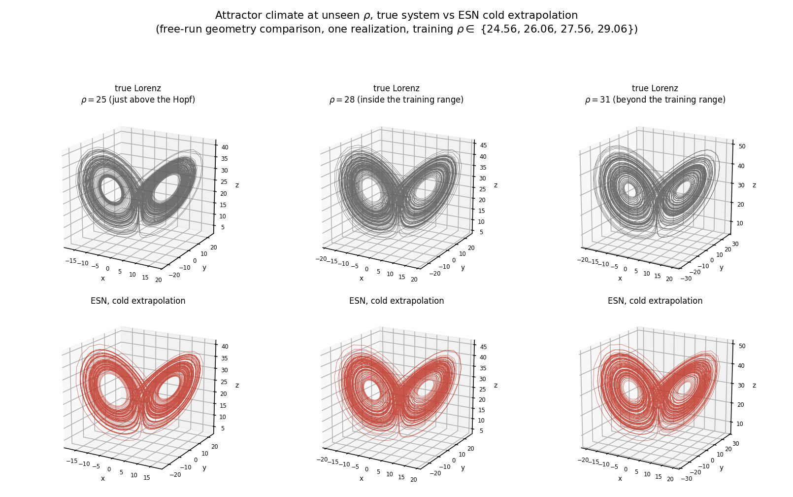
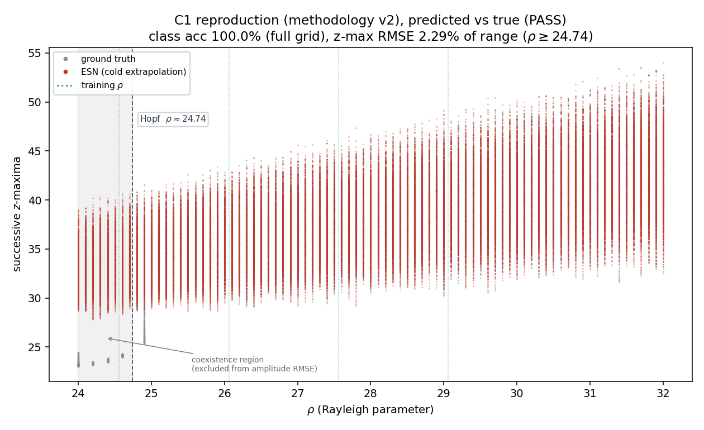

# Parameter-Aware Echo State Networks for Lorenz Regime Transitions

If an echo state network is trained on Lorenz trajectories at only a few values
of ρ, with ρ supplied as an extra input channel, can it reconstruct the
bifurcation diagram at values it never saw? And what controls how far past the
training window it stays right?

This repository contains the code, experiments, and figures for
the question at hand, and the README covers
what the project found and how to reproduce it.



*True Lorenz attractor (top, grey) vs. the ESN free-running cold (bottom, red) at
three values of ρ the network never trained on. This is a climate-comparison for the
geometry that the network settles onto, not a comparison regarding the pointwise trajectory.*

## Each of the five contributions

- **C1**: Reproduce the bifurcation diagram from four training values
  (specifically the gate since nothing else runs until this passes).
- **C2**: Extrapolation reach vs. training-range **width**.
- **C3**: Extrapolation reach vs. training-sample **density**.
- **C4**: Across-Hopf behaviour vs. training-window **position**.
- **C5**: Full reproducibility from a clean checkout.

Every sweep holds the architecture and total training data (120,000 network
steps) fixed, so density effects can't hide data-volume effects.

## Results

All five contributions pass, and the acceptance bar for each of them is quoted with their respective results below

- **C1** passes on all three criteria
  1. Regime-class accuracy 100% on the full
  grid (bar at ≥ 95%)
  2. z-maxima amplitude RMSE 2.29% of the z-range on the
  chaotic band ρ ≥ 24.74 (bar at ≤ 5%)
  3. Largest-Lyapunov agreement 6.1% (bar at ≤ 10%).
  


*Predicted z-maxima (red) against the true diagram (grey). Dotted lines mark the
four training ρ, the dashed line is the Hopf, and the shaded band is the coexistence
region, excluded from the amplitude RMSE.*
- **C2** is non-monotone
  - Marginal reach falls from Δρ = 1.20 at W = 2 to 0.20
  at W = 8, then rises to 1.50 at W = 10, while the absolute ceiling climbs
  cleanly from 31.2 to 35.5.
  - The upturn survives a Hopf-clamped robustness
  check, so it's a real feature of the wide window, not sub-Hopf contamination.
- **C3** saturates
  - From M = 3 samples onwards, the reach is flat at Δρ ≈ 0.30 no matter
  how densely the window is filled.
- **C4** finds that no window crosses the Hopf cleanly.
  - Instead, every window, regardless of position, places the predicted collapse at ρ ≈ 24.10
  - ρ ≈ 24.10 is the coexistence onset where the chaotic attractor actually terminates 
  - This overshoots the true Hopf ρ ≈ 24.74 by the same 0.64.
- **C5** finds that the pipeline is deterministic on the pinned stack, so a clean checkout
  rebuilds every figure bit for bit.

In practical terms, the reach is set by where the window edge sits, not how the
window is filled. Spend a fixed data budget on widening the range, not
densifying it.

A methodological note worth knowing before reading the code is that the C1 amplitude
RMSE is scored **only** on ρ ≥ 24.74. Below the Hopf, the chaotic attractor coexists
with the stable fixed-point pair, so a single-initial-condition ground-truth
envelope is multivalued there and the metric stops measuring what it claims to.
The full-grid value of 7.61% is recorded while the full diagnosis is in the accompanying paper (scroll down to the very bottom for the BibTeX citation).

## Layout

| Path | Contents |
|------|----------|
| `src/lorenz.py` | RK4 integrator, regime classifier, Lyapunov exponent |
| `src/reservoir.py` | Parameter-aware ESN (sparse reservoir, ridge readout) |
| `src/metrics.py` | Valid prediction time and related metrics |
| `src/training.py` | Segment builder, realization training, C1 acceptance test |
| `src/sweep.py` | C2-C4 extrapolation-distance measurement and sweep definitions |
| `experiments/run_c1.py`, `run_c1_v2.py` | C1 gate: train, cold-extrapolate, score (v2 = revised criterion, checkpoint/resume) |
| `experiments/build_truth_cache.py` | Ground-truth cache shared by C2-C4 |
| `experiments/run_sweep.py` | Chunked, resumable C2-C4 driver with finalization |
| `experiments/make_figures.py`, `make_attractor_figure.py` | Figures 2-4 from result JSONs; Figure 5 (attractor climate) |
| `experiments/gate_one.py` | Score a single hyperparameter configuration |
| `experiments/exp0*.ipynb` | Exploratory notebooks from early sessions |
| `data/` | Shipped result cells and diagnostics (caches regenerate, gitignored) |
| `figures/` | Output plots and per-sweep result JSONs |
| `REPRODUCIBILITY.md` | Seeds, determinism, cached vs. regenerated artifacts, tolerances |

The per-result cells (per config and realization) under `data/C{2,3,4}_cells/` and the
C1 prediction cells are shipped so that the figures rebuild in seconds. The ground-truth
and segment caches are not shipped, meaning that they regenerate from logged seeds.

## Reproducing the figures

One-to-one reproduction needs the following pinned environment containing Python 3.12.3 with the
pinned numpy, scipy, and matplotlib. Other versions give statistically
equivalent runs and not identical ones given that the sparse-matrix RNG and the eigensolver
are very much version-sensitive (see `REPRODUCIBILITY.md`).

```bash
python3 -m venv .venv && source .venv/bin/activate
pip install -r requirements.txt
cd experiments
```

Because the compute environment this was built in kills long single jobs, every runner checkpoints one cell per process and resumes. 
The shipped cells let you skip the long runs entirely.

**Fast path**: Figures 2-4 in seconds from the shipped cells:

```bash
python run_sweep.py --mode finalize --sweep C3 --R 32   # same for C2 / C4
python make_figures.py
```

**Full path**: Rebuild Figures 2-4 from scratch (this is what reproduces the
cells bit-for-bit):

```bash
python build_truth_cache.py                              # approximately 4-5 mins, once
for s in C2 C3 C4; do
  while python run_sweep.py --mode run --sweep $s --R 32 --max-cells 60 \
        | grep -q "batch cap"; do :; done                # repeat until done
  python run_sweep.py --mode finalize --sweep $s --R 32
done
python make_figures.py
```

**Figure 1** (C1) has its own ground-truth cache:

```bash
python run_c1.py --realizations 1                        # builds the cache
python run_c1_v2.py --mode run --upto 10 --batch 10      # repeat until 10/10
python run_c1_v2.py --mode finalize --upto 10
```

**Figure 5** needs no caches since it trains one realization fresh and free-runs at
three unseen ρ:

```bash
python make_attractor_figure.py                          # roughly 15 seconds
```

Assuming a clean checkout, these are the following respective timings for the pinned stack: 
- Figure 1 takes roughly **8 mins**
- Figures 2-4 take roughly **22–27 mins each**
- Figure 5 takes roughly **15 seconds**.
- The entire pipeline takes just **a little over an hour** end to end.

## Brief overview of the model

A sparse reservoir of N = 500 nodes is governed by the three standardized Lorenz
coordinates, including a fourth channel carrying the normalized parameter

```math
\mathbf{r}(t+\Delta t) \,=\, (1-\alpha)\,\mathbf{r}(t)
\,+\, \alpha \tanh\big( W_r\,\mathbf{r}(t) + W_{\mathrm{in}}\,\mathbf{u}(t) + \mathbf{b} \big),
\qquad
\mathbf{u} = [\hat{x},\ \hat{y},\ \hat{z},\ \hat{p}\,]^{\top}
```

where p̂ is ρ mapped onto a fixed reference interval. The state and parameter
columns of W_in are scaled separately (γ_in and γ_p), which turns out, matters more than I
expected. γ_p turned out to be the one lever that actually moved the C1 error,
and it moved it in the opposite way from my initial guess. The readout is plain
ridge regression solved in closed form

```math
W_{\mathrm{out}} = V R^{\top} \big( R R^{\top} + \lambda I \big)^{-1}
```

For the bifurcation diagram the network runs cold. There is no ground-truth trajectory
at the target ρ, just the parameter value and a free run.

These are the following confirmed hyperparameters 
- γ_p = 0.1
- spectral radius = 0.6
Everything else at the documented priors. These are the `ESNConfig` defaults and carry into every
sweep unchanged. Full details are in the accompanying paper/manuscript.

## BibTeX citation

The accompanying paper is in preparation. Until it's published, cite the
repository directly.

```
Placeholder here while waiting for BibTeX citation
```
